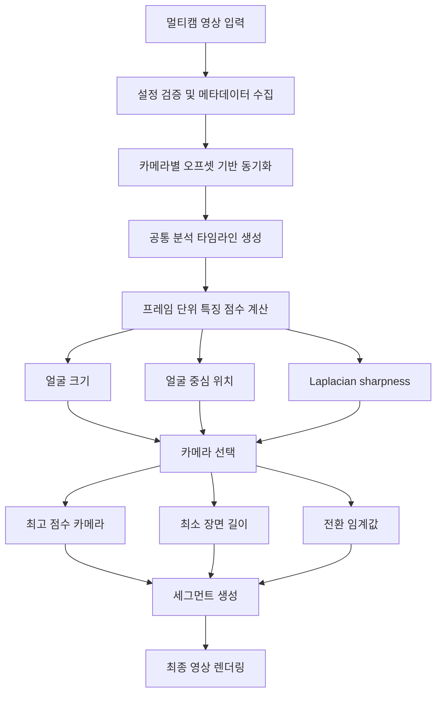

# K-Pop Autocut

<p>
  
  
  
  
  
  
</p>

K-Pop 무대 멀티캠 영상을 분석해 카메라 전환 구간을 선택하고, 하나의 편집 영상으로 합성하는 Computer Vision 기반 자동 편집 프로젝트입니다.

현재 구현은 `main.py` 하나로 실행됩니다. 4개의 무대 영상을 오프셋 기준으로 동기화하고, 같은 타임라인 시점에서 각 카메라 프레임을 비교한 뒤, 얼굴 위치/크기와 프레임 선명도를 기준으로 카메라를 선택합니다.

## Project Overview

| 항목 | 내용 |
| --- | --- |
| 프로젝트명 | K-Pop Autocut |
| 프로젝트 기간 | 2026.04.27 ~ |
| 주제 | K-Pop 무대 영상 멀티캠 자동 편집 |
| 핵심 기술 | OpenCV, MediaPipe, MoviePy, 영상 동기화, 프레임 점수화, 자동 카메라 선택 |
| 입력 | 동일 무대를 촬영한 4개 멀티캠 `.mp4` 영상 |
| 출력 | 자동 편집된 `edited_output.mp4` |
| 현재 구현 | 오프셋 기반 동기화, 공통 타임라인 생성, 프레임 점수화, 카메라 선택, 세그먼트 합성 |

## Problem

K-Pop 무대 영상은 여러 카메라가 동시에 같은 공연을 촬영하고, 편집자는 인물의 위치, 화면 구도, 화질, 장면 흐름을 고려해 컷을 선택합니다. 이 과정은 반복적이고 시간이 많이 듭니다.

단순 rule-based 방식은 일정 시간마다 카메라를 바꾸거나 단일 지표만 사용하기 때문에 장면 흐름을 반영하기 어렵습니다.

이 프로젝트는 멀티캠 자동 편집을 다음과 같은 문제로 다룹니다.

> 동일 타임라인 위의 여러 카메라 후보를 점수화하고, 과도한 전환을 줄이면서 카메라 선택 시퀀스를 생성한다.

## Current Features

`main.py`는 입력부터 출력까지 한 번에 실행되는 자동 편집 파이프라인을 제공합니다.

| 기능 | 설명 |
| --- | --- |
| 멀티캠 입력 검증 | 4~6개 영상 입력을 기준으로 파일 존재 여부, FPS, 프레임 수, 해상도, 오프셋을 검증합니다. |
| 오프셋 기반 동기화 | 카메라별 시작 오프셋을 반영해 같은 공연 시점의 프레임을 조회합니다. |
| 공통 타임라인 생성 | 모든 카메라가 공통으로 사용할 수 있는 구간을 계산하고 일정 간격으로 분석합니다. |
| 해상도 정규화 | 분석 및 렌더링 기준 해상도를 `1280x720`으로 통일합니다. |
| 프레임 점수화 | 얼굴 검출 결과와 Laplacian sharpness를 사용해 카메라별 프레임 점수를 계산합니다. |
| 자동 카메라 선택 | 최고 점수 카메라를 선택하되, 최소 장면 길이와 전환 임계값으로 잦은 스위칭을 방지합니다. |
| 세그먼트 생성 | 선택된 카메라 시퀀스를 기반으로 편집 구간을 생성합니다. |
| 영상 합성 | MoviePy로 세그먼트를 연결하고 기준 카메라의 오디오를 유지해 최종 영상을 출력합니다. |

## Pipeline



## Scoring Logic

현재 구현은 각 카메라의 프레임을 다음 기준으로 점수화합니다.

| 점수 요소 | 의미 |
| --- | --- |
| Face size score | 얼굴 영역이 충분히 크게 잡힌 카메라를 선호합니다. |
| Center score | 얼굴이 화면 중앙에 가까운 카메라를 선호합니다. |
| Sharpness score | Laplacian variance로 선명한 프레임을 선호합니다. |

현재 점수는 다음 직관을 따릅니다.

```text
frame_score = 0.5 * face_size + 0.3 * face_center + 0.2 * sharpness
```

얼굴이 검출되지 않은 경우에는 선명도만 일부 반영해 낮은 점수를 부여합니다. MediaPipe Face Detection을 우선 사용하고, 런타임에서 사용할 수 없는 경우 OpenCV Haar Cascade를 사용합니다.

## Tech Stack

| Category | Stack | Usage |
| --- | --- | --- |
| Language |  | 전체 파이프라인 구현 |
| Computer Vision |   | 영상 메타데이터 처리, 얼굴 검출, 프레임 분석 |
| Video Processing |   | 세그먼트 합성, 오디오 유지, 최종 영상 렌더링 |
| Numerical Processing |  | 점수 계산, 카메라 선택 로직 |

## Project Structure

```text
.
├── main.py                  # 멀티캠 자동 편집 메인 파이프라인
├── README.md                # 프로젝트 소개 및 실행 문서
├── .gitignore               # 로컬 영상, 가상환경, 문서 초안 제외
├── stage1.mp4               # 입력 영상 예시, Git에는 포함하지 않음
├── stage2.mp4               # 입력 영상 예시, Git에는 포함하지 않음
├── stage3.mp4               # 입력 영상 예시, Git에는 포함하지 않음
├── stage4.mp4               # 입력 영상 예시, Git에는 포함하지 않음
└── edited_output.mp4        # 실행 후 생성되는 자동 편집 결과물
```

대용량 영상 파일은 GitHub 일반 저장소에 올리지 않고 로컬에서만 사용합니다.

## Getting Started

### 1. Clone repository

```bash
git clone https://github.com/huiseong29/kpop-autocut.git
cd kpop-autocut
```

### 2. Create virtual environment

```bash
python -m venv .venv
source .venv/bin/activate
```

Windows Git Bash에서는 다음 명령을 사용할 수 있습니다.

```bash
source .venv/Scripts/activate
```

### 3. Install dependencies

```bash
pip install opencv-python mediapipe numpy moviepy
```

MoviePy 렌더링을 위해 FFmpeg가 필요합니다. 설치 후 아래 명령으로 확인할 수 있습니다.

```bash
ffmpeg -version
```

### 4. Prepare input videos

프로젝트 루트에 동일 무대의 멀티캠 영상을 아래 이름으로 배치합니다.

```text
stage1.mp4
stage2.mp4
stage3.mp4
stage4.mp4
```

현재 `main.py`의 기본 오프셋은 다음과 같습니다.

```python
OFFSETS_SEC = {
    "stage1.mp4": 3.5,
    "stage2.mp4": 29.5,
    "stage3.mp4": 0.1,
    "stage4.mp4": 0.0,
}
```

다른 영상을 사용할 경우 `VIDEO_PATHS`와 `OFFSETS_SEC`를 영상 파일명과 싱크에 맞게 수정해야 합니다.

### 5. Run

```bash
python main.py
```

실행이 완료되면 프로젝트 루트에 다음 파일이 생성됩니다.

```text
edited_output.mp4
```

## Implementation Highlights

주요 구현 포인트는 다음과 같습니다.

| 구현 포인트 | 설명 |
| --- | --- |
| 설정 객체화 | `PipelineConfig`로 입력 경로, 오프셋, 분석 간격, 출력 경로를 관리합니다. |
| 메타데이터 모델링 | `VideoMeta`로 FPS, 프레임 수, 해상도, 길이, 사용 가능 구간을 구조화합니다. |
| 동기 프레임 조회 | 각 카메라의 오프셋을 반영해 같은 타임라인 시점의 프레임을 읽습니다. |
| 전환 안정화 | 최소 장면 길이와 점수 차이 임계값을 사용해 불필요한 카메라 전환을 줄입니다. |
| 출력 자동화 | 선택된 카메라 구간을 MoviePy로 연결하고 오디오를 유지합니다. |

## Summary

이 프로젝트는 멀티캠 편집 과정을 입력 검증, 동기화, 프레임 분석, 카메라 선택, 영상 렌더링까지 연결한 실행 가능한 파이프라인으로 구현했습니다.

핵심 구현 역량은 OpenCV 기반 영상 메타데이터 처리, MediaPipe 기반 얼굴 검출, 프레임 품질 점수화, 멀티캠 시간 동기화, MoviePy 기반 영상 합성입니다.
